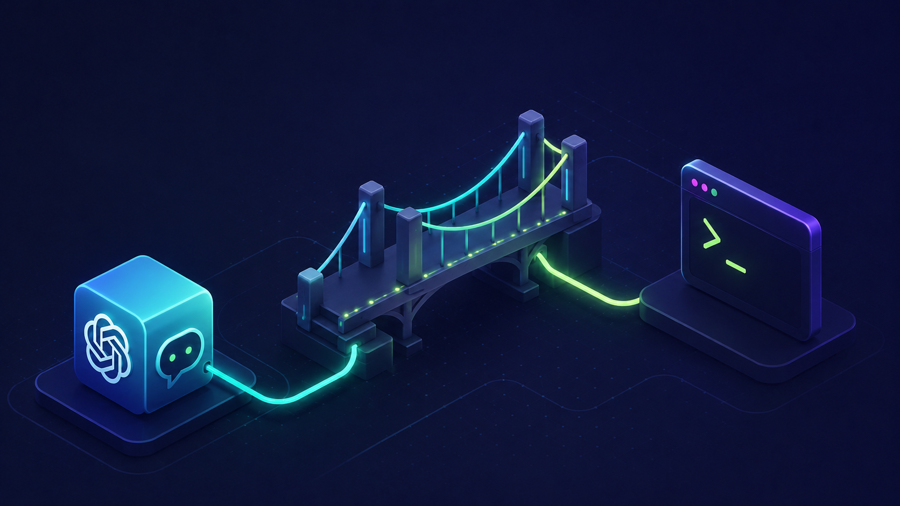

<p align="center">
  
</p>

# chatgpt-local-bridge

[English](README.md) · [עברית](README.he.md) · **Español** · [中文](README.zh.md)


---

> Controla una conversación real de ChatGPT en el navegador desde tu terminal y dale un conjunto reducido y aislado (sandbox) de herramientas locales del repositorio vía MCP — sin entregarle nunca una shell.

## Por qué existe

ChatGPT rinde mejor en el navegador: el estado real de la cuenta, el selector de modelos, la edición de mensajes, la regeneración y el historial de conversación se mantienen intactos. Programar rinde mejor en la terminal, donde archivos, pruebas, diffs y parches se inspeccionan y modifican directamente.

`chatgpt-local-bridge` conecta esas dos superficies. Un prompt en la terminal controla tu sesión existente de ChatGPT en el navegador, y ChatGPT puede acceder al repositorio actual mediante un pequeño conjunto de **herramientas MCP validadas** — `grep`, `read`, `apply_patch`, `run_tests`, `git_diff` — en lugar de acceso directo a la shell. Tú permaneces en un único flujo de terminal; ChatGPT conserva su interfaz real.

## Características

- **ChatGPT desde la terminal** — envía prompts y recibe respuestas sin salir de la shell; la conversación real del navegador es la fuente de verdad.
- **Herramientas locales en sandbox vía MCP** — cada operación de archivo se valida contra la raíz del repositorio seleccionado; sin shell arbitraria, solo comandos de prueba en lista blanca.
- **Acciones del navegador como comandos** — `/resume`, `/new`, `/model`, `/rewind`, `/stop`, `/context`, `/diff`, `/compact` y más.
- **Sesiones y transcripciones locales por repositorio** — cada ejecución se registra en `<repo>/.bridge/` y se exporta como Markdown, JSON o JSONL.
- **Controles de seguridad** — modos de permiso (`read-only` / `ask` / `auto`) y checkpoints automáticos de archivos alrededor de cada parche.
- **Convenciones del proyecto** — comandos personalizados además de `AGENTS.md` / `CLAUDE.md` se envían a ChatGPT en las ejecuciones de `/task`.
- **Un editor real** — historial de prompts, búsqueda inversa, cola de prompts y autocompletado de menciones `@file`.

## Arquitectura

```text
 terminal (you)
      │
      │  Ink / React CLI
      ▼
 orchestrator ──────────────┬───────────────────────────────┐
      │  browser automation │                   MCP server   │
      ▼  (Playwright + CDP) │                  (MCP SDK)      ▼
 ChatGPT browser UI         │                        local repo tools
      ▲                     │                     (grep/read/patch/test/diff)
      │                     ▼                                 │
      └───── Cloudflare Tunnel (cloudflared) ◄────────────────┘
              public https://…trycloudflare.com/mcp
```

Cuatro capas, cada una con un solo trabajo:

| Capa | Tecnología | Responsabilidad |
|------|------------|-----------------|
| **CLI** | Ink / React | Interfaz de terminal: panel de mensajes, barra de estado, menciones `@file`, comandos `/`. |
| **Navegador** | Playwright + Chrome DevTools Protocol | Controla la pestaña real de ChatGPT y captura respuestas. Los selectores están aislados en `src/browser/chatgpt-page.ts` para que los cambios de UI sean fáciles de arreglar. |
| **Servidor MCP** | MCP SDK + Zod | Expone las herramientas locales del repositorio a ChatGPT como handlers validados por esquema y en sandbox. |
| **Túnel** | Cloudflare Tunnel (`cloudflared`) | Da al servidor MCP local una URL HTTPS pública temporal que el conector de ChatGPT puede alcanzar — sin despliegue. |

**¿Por qué un túnel?** El conector MCP de ChatGPT llama a las herramientas por HTTPS, pero el servidor de herramientas se ejecuta en tu máquina. En lugar de desplegar nada, el bridge levanta un túnel efímero de Cloudflare (`*.trycloudflare.com`) frente al puerto local y sincroniza esa URL `…/mcp` con la app de ChatGPT al iniciar. (ngrok resolvería el mismo problema de alcance; se usa `cloudflared` de Cloudflare porque sus túneles rápidos no requieren cuenta ni token.)

## Inicio rápido

**Requisitos previos**

- **macOS** — Chrome se inicia desde `/Applications/Google Chrome.app`, y los ayudantes de portapapeles/procesos usan `pbcopy`/`lsof`.
- **Node.js ≥ 20** y **pnpm** (el repo fija `pnpm@10.14.0`).
- **Google Chrome** — el bridge controla un perfil real de Chrome.
- **`cloudflared`** *(opcional)* — solo necesario para que ChatGPT llame a herramientas locales. Sin él la TUI igual funciona. Instala con `brew install cloudflared`.

**Instalar y construir**

```bash
git clone https://github.com/YosefHayim/chatgpt-local-bridge.git
cd chatgpt-local-bridge
pnpm install
pnpm build
```

**Inicia sesión una vez y luego ejecuta**

```bash
# Abre el perfil aislado de Chrome del bridge e inicia sesión en ChatGPT (persiste entre ejecuciones)
node dist/bridge.js login

# Lanza la interfaz de terminal sobre el repositorio donde ChatGPT trabajará
node dist/bridge.js --repo /path/to/your/project
```

¿Prefieres un comando `bridge` global? Ejecuta `pnpm link --global` tras construir, y usa `bridge`, `bridge login`, `bridge ask "…"`, etc.

## Dónde se guarda el estado

Todo el estado del bridge para un proyecto se escribe **dentro de ese proyecto**, bajo `<repo>/.bridge/`. En el primer uso, el bridge escribe `.bridge/.gitignore` con un único `*`. Eso hace que git ignore **todo** lo que hay en el directorio — incluidas las transcripciones y las cookies de inicio de sesión — de modo que nada pueda llegar a un commit, aunque viva dentro del repositorio. Tanto `git add -A` como `git add .bridge/` lo omiten; solo un `git add -f` explícito podría forzarlo. El archivo se reafirma en cada ejecución, así que borrarlo o manipularlo se cura automáticamente.

> La configuración escrita por el usuario y destinada a aplicarse a **todos** los repositorios sigue en tu directorio home: comandos personalizados en `~/.chatgpt-local-bridge/commands/*.md` y hooks de usuario en `~/.chatgpt-local-bridge/hooks.json`.

## Permisos y checkpoints

```bash
/permissions read-only   # grep_code, read_file, git_diff
/permissions auto        # también las herramientas de escritura/prueba acotadas
/permissions ask         # bloquea herramientas de escritura/prueba/proceso (confirmación interactiva pendiente)
```

`apply_patch` toma un snapshot de cada ruta tocada antes y después del cambio. Recupera con `/checkpoints`, `/restore <id>` o `/rewind --files <id>`.

## Pruebas

```bash
pnpm test          # vitest run
pnpm typecheck     # tsc --noEmit
pnpm verify:push   # typecheck + test + build (ejecutar antes de push)
```

La cobertura se centra en las rutas sensibles a la seguridad — validación de sandbox, resolución de rutas locales del repositorio, la auto-exclusión de `.bridge/`, los almacenes de sesiones/checkpoints, permisos y conteo de contexto.

## Limitaciones

- **Solo macOS** por ahora (ruta de Chrome fija y ayudantes `pbcopy`/`lsof`).
- Los selectores del navegador de ChatGPT pueden romperse cuando cambia la UI web; los arreglos están localizados en la capa del navegador.
- El uso de contexto es una **estimación** — el navegador no expone el conteo exacto de tokens del servidor.
- El túnel de Cloudflare requiere `cloudflared` instalado.
- Local-first por diseño; no es un servicio multiusuario alojado.
- La ejecución de comandos de hooks se analiza y reporta pero aún no se ejecuta.

## Licencia

[MIT](LICENSE) © YosefHayim
